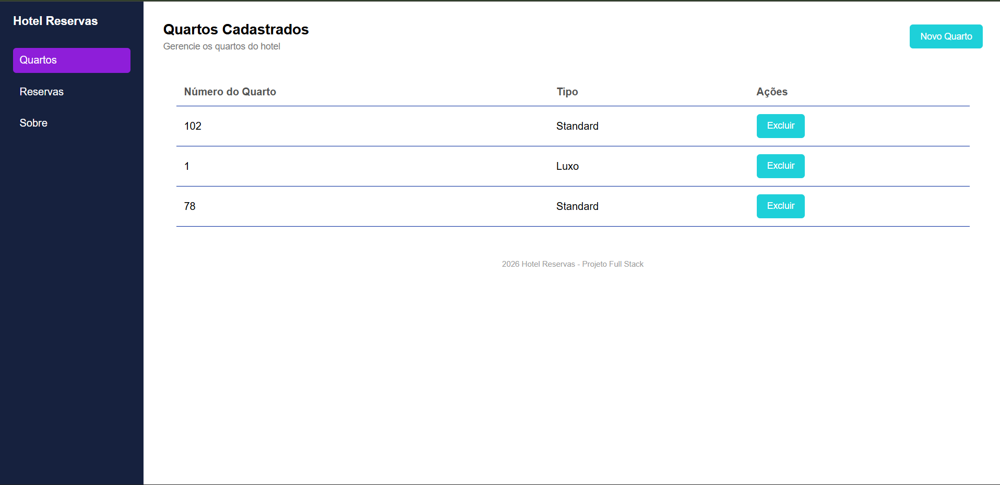
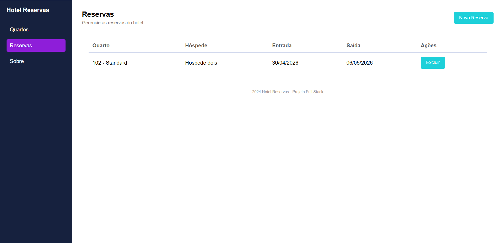

# 🏨 Sistema de Reservas de Hotel

Este é um sistema simples e completo para gerenciamento de quartos e reservas de um hotel. O projeto é composto por uma **API/Backend** em Node.js com Express e Prisma (conectando a um banco MySQL/MariaDB) e um **Frontend** responsivo em HTML, CSS e JavaScript Vanilla.

---

## Tecnologias Utilizadas

### Frontend
- HTML5 (Estrutura semântica)
- CSS3 (Estilização responsiva e moderna)
- JavaScript Vanilla (Consumo da API e manipulação do DOM)

### Backend
- Express (Estruturação de rotas e servidor web)
- CORS (Gerenciamento de rotas)
- Prisma (Comunicação com o banco de dados)
- MySQL / MariaDB (Persistência dos dados)

## Global 
- VsCode
- Node.js
- XAMPP
- GitHub
- Git
- Insomnia (Teste de URL)
- Live Server Extensão

---

## Como testa localmente

1. Copie o link do repositório:
    ``` bash
    https://github.com/EnzoToniato567/Hotel-Reservas.git
    ```

2. Abra com Git Bash Terminal

3. Clone este repositório com o comando ```git clone``` + link do repositório - (Utilize `SHIFT + Insert`)

4. Abra a pasta com VsCode 

---

## Como Executar o Projeto

### 1. Configurar o Backend (API)

1. Navegue até o diretório da API:
   ```bash
   cd api
   ```
2. Instale as dependências necessárias:
   ```bash
   npm i
   ```
3. Configure as variáveis de ambiente no arquivo `.env` na pasta `/api` com a URL de conexão do seu banco de dados:
   ```env
   DATABASE_URL="mysql://root@localhost:3306/mydb"
   ```
4. Sincronize o banco de dados utilizando as definições do Prisma:
   * Migrate: ```bash
        npx prisma migrate dev
   ```
   * Generate: ```bash
        npx prisma generate
   ```
  
5. Inicie o servidor de desenvolvimento:
   ```bash
   node server.js
   ```
   *A API iniciará por padrão no endereço `http://localhost:3000`.*

### 2. Executar o Frontend

1. Navegue até a pasta `web`.
2. Abra o arquivo `index.html` no seu navegador de preferência ou inicie utilizando o *Live Server* no VS Code.

---

## Demonstração (Screenshots)

### Gerenciamento de Quartos


### Gerenciamento de Reservas

